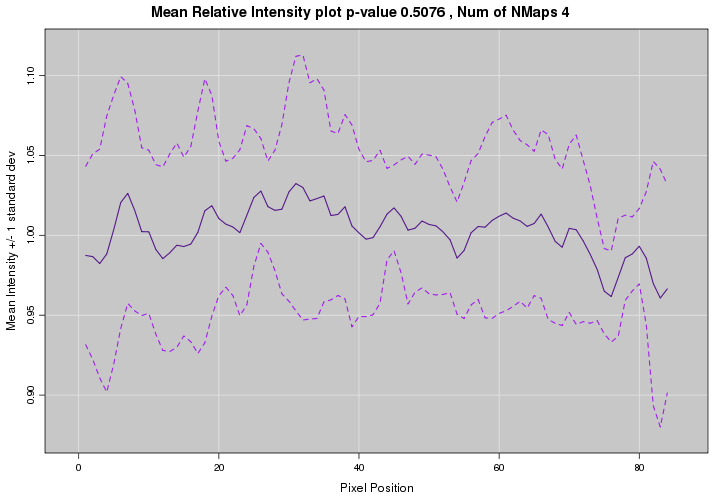
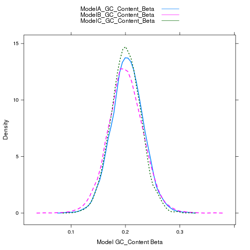

Intensity & GC Content Report3
========================================================
### Author: Subhrangshu Nandi
### Date: 2013-09-17

### Background

- Response variable: Fluoroscence Intensity
- Covariates: GC Content, Length of fragment, Stretch factor
- Adjacent fragments share the same error
- All 7,134 groups included in this model
- Outliers are eliminated (& documented for further consideration)

### Model

- 15 groups (or channels) are randomly selected from clean data
- Average 50 molecules per group
- Molecule level random effect added (to control for adjacent fragment similarity)
- Three different models:
  1. OLS (no weights)
  2. Weights based on coverage of fragment location (higher the coverage, higher the weight)
  3. Weights based on variance (higher the variance, lower the weight)

### R-Squares of three models





- Model A (No weights)

```
##   Min. Median   Mean   Max. 
##  0.297  0.722  0.708  0.947
```

- Model B (Weights by coverage of fragment location)

```
##   Min. Median   Mean   Max. 
##  0.294  0.731  0.718  0.956
```

- Model C (Weights by variance of fragment location)

```
##   Min. Median   Mean   Max. 
##  0.298  0.724  0.712  0.943
```


### Intercept of three models
- Model A (No weights)

```
##   Min. Median   Mean   Max. 
##   10.2   10.7   10.7   11.1
```

- Model B (Weights by coverage of fragment location)

```
##   Min. Median   Mean   Max. 
##   10.2   10.7   10.7   11.1
```

- Model C (Weights by variance of fragment location)

```
##   Min. Median   Mean   Max. 
##   10.2   10.7   10.7   11.1
```


### Beta of GC Content of three models



### Beta of GC Content of three models
- Model A (No weights)

```
##   Min. Median   Mean   Max. 
## 0.0893 0.2040 0.2040 0.3150
```

- Model B (Weights by coverage of fragment location)

```
##   Min. Median   Mean   Max. 
## 0.0527 0.2000 0.2000 0.3630
```

- Model C (Weights by variance of fragment location)

```
##   Min. Median   Mean   Max. 
## 0.0987 0.2010 0.2010 0.3170
```


Final Equation
========================================================

$log(Intensity) = 10.7 + 0.20 GC\_Content + Other Factors + \epsilon$

$R^2 = 73\%$
